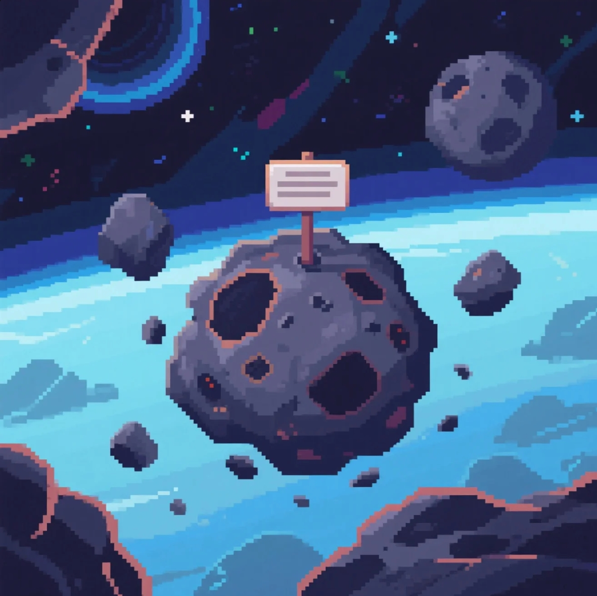

# Meteorite Drift Bottle



<p align="center">
  <strong>A Gamified Social Platform for Anonymous Interstellar Connections</strong>
</p>

<p align="center">
  <a href="https://meteoritebottle.xyz" target="_blank">Official Website</a> •
  <a href="https://x.com/MeteoriteBottle" target="_blank">Twitter</a>
</p>

<p align="center">
  <a href="#features">Features</a> •
  <a href="#tech-stack">Tech Stack</a> •
  <a href="#getting-started">Getting Started</a> •
  <a href="#documentation">Documentation</a> •
  <a href="#community">Community</a> •
  <a href="#contributing">Contributing</a> •
  <a href="#license">License</a>
</p>

## Overview

MeteoriteDriftBottle is a revolutionary social platform that transforms traditional message-in-a-bottle into an immersive interstellar experience. Set in a pixelated universe, users can send and receive messages through meteorites, play mini-games, and connect with others in real-time through a cosmic radio wave chatroom.

## Features

### 🌠 Meteorite Messaging System
- Send and receive anonymous messages through meteorites
- Intelligent matching algorithm for message distribution
- Privacy-focused with zero-knowledge proofs
- Cross-cultural social connections
- Customizable message bottles with unique designs

### 🎮 Pixel Mini-Games
- Interstellar navigation challenges
- Resource collection missions
- Customizable pixel spaceships
- Blockchain-based rewards system
- Competitive leaderboards

### 💫 Radio Wave Chatroom
- Real-time community interaction
- Themed events and discussions
- Multi-language support
- Voice chat capabilities
- Emoji and sticker support

### 🛡️ Privacy & Security
- End-to-end encryption
- Anonymous messaging
- Decentralized data storage
- Regular security audits
- User data protection

### 🌟 Community Features
- Token-based governance
- Community-driven content curation
- Regular community events
- Reward programs
- Social engagement incentives

## Tech Stack

### Frontend
- React.js with TypeScript
- WebGL & Phaser.js for game rendering
- Socket.io for real-time communication
- Responsive design with TailwindCSS
- Progressive Web App (PWA) support

### Backend
- Node.js/Express
- WebSocket for real-time features
- Redis for caching
- Microservices architecture
- Load balancing with Nginx

### AI/ML
- Transformer models for content analysis
- Reinforcement Learning for user matching
- GANs for pixel art generation
- Natural Language Processing
- Sentiment analysis

### Blockchain
- Solana blockchain integration
- Smart contracts for token management
- Web3 wallet integration
- NFT support
- Cross-chain compatibility

### Storage
- IPFS for decentralized storage
- PostgreSQL for structured data
- Redis for caching
- Content delivery network (CDN)
- Automated backups

## Getting Started

### Prerequisites
```bash
# Install Node.js (v16+)
npm install -g yarn
```

### Installation
```bash
# Clone the repository
git clone https://github.com/yourusername/meteorite-drift-bottle.git

# Install dependencies
cd meteorite-drift-bottle
yarn install

# Configure environment variables
cp .env.example .env

# Start development server
yarn dev
```

### Development Environment
- Node.js v16 or higher
- Yarn package manager
- Docker for containerization
- Git for version control
- IDE with TypeScript support

## Documentation

### Technical Documentation
- [Technical Architecture](./docs/architecture.md)
- [API Reference](./docs/api-reference.md)
- [Game Development Guide](./docs/game-dev-guide.md)
- [Smart Contract Documentation](./docs/smart-contracts.md)
- [Security Guidelines](./docs/security.md)

### User Guides
- [Getting Started Guide](./docs/getting-started.md)
- [User Manual](./docs/user-manual.md)
- [FAQ](./docs/faq.md)
- [Troubleshooting](./docs/troubleshooting.md)
- [Community Guidelines](./docs/community-guidelines.md)

## Community

### Connect With Us
- [Official Website](https://meteoritebottle.xyz)
- [Twitter](https://x.com/MeteoriteBottle)
- [Discord Community](https://discord.gg/meteoritebottle)
- [Telegram Group](https://t.me/meteoritebottle)
- [Medium Blog](https://medium.com/@meteoritebottle)

### Development Status
- [Project Roadmap](./docs/roadmap.md)
- [Release Notes](./docs/releases.md)
- [Known Issues](./docs/issues.md)
- [Feature Requests](./docs/feature-requests.md)
- [Development Updates](./docs/updates.md)

## Contributing

We welcome contributions from the community! Here's how you can help:

1. Fork the repository
2. Create your feature branch (`git checkout -b feature/AmazingFeature`)
3. Commit your changes (`git commit -m 'Add some AmazingFeature'`)
4. Push to the branch (`git push origin feature/AmazingFeature`)
5. Open a Pull Request

Please read our [Contributing Guidelines](./CONTRIBUTING.md) for more details.

## Security

### Security Measures
- Regular security audits
- Bug bounty program
- Penetration testing
- Vulnerability disclosure program
- Security best practices

### Reporting Security Issues
If you discover a security vulnerability, please send an email to security@meteoritebottle.xyz. We take all security concerns seriously.

## License

This project is licensed under the MIT License - see the [LICENSE](./LICENSE) file for details.

## Acknowledgments

- Inspired by the traditional message in a bottle concept
- Built with modern web technologies
- Powered by the open-source community
- Special thanks to our contributors
- Supported by the Solana ecosystem

---

<p align="center">
Made with ❤️ by the Meteorite Drift Bottle Team
</p>
